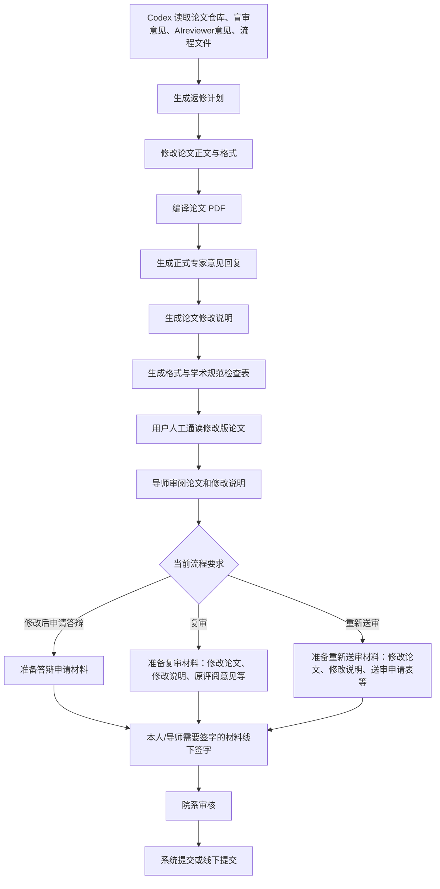

# 给 Codex 的任务指令

> 来源：临时工作目录 L_26_6 整理
> 整理日期：2026-06-17
>
> **说明：** 本文档包含可直接粘贴给 Codex 的 `/goal` 指令，用于博士学位论文终稿返修与答辩材料整合。

---

## 总目标

对当前博士学位论文《面向旋转机械可解释智能诊断的神经符号网络方法研究》进行系统返修、回应评阅意见、整合 AIreviewer 建议、检查清华论文格式与学术规范，并输出可用于答辩/复审/定稿前检查的完整材料包。

**最终目标是：**

1. 逐条回应正式盲审专家意见，生成规范、克制、学术化、可提交的 response / 修改说明。
2. 整合 AIreviewer 额外意见，补齐论文中结构、逻辑、表达、格式、图表、引用、学术规范等风险点。
3. 进一步润色和优化论文，使其从"可通过"提升到"优秀博士论文候选水准"：主线清晰、创新点突出、论证严密、图表规范、语言凝练、避免AI幻觉、AI口吻、格式稳定、引用可追踪。
4. 生成所有需要的材料清单、修改记录和用户后续操作步骤。
5. 全程不得编造数据、文献、实验结果、政策要求或评阅意见；所有修改必须可追踪、可解释、可撤销。

---

## 核心原则

### 论文主线必须守住

这篇论文的主线不是"做了几个可解释模型"，而是：

**围绕旋转机械智能诊断中"高性能—高可信难以兼得"的矛盾，提出神经符号网络 NSNet 框架，并从理论、模型到任务级系统完整落地。**

全文核心口径：

1. 可解释性不是事后可视化，不是给黑盒模型附加解释器。
2. 本文将可解释性内生化到假设空间、算子结构、稀疏拓扑和逻辑推理流程中。
3. 统一约束应围绕：
   - 物理同构性
   - 结构稀疏性
   - 逻辑相容性
4. 样本级解释对象应围绕：
   - 可回到物理语义的参数
   - 部署阶段确定的稀疏推理拓扑
   - 规则满足度向量
5. 第 3、4、5 章不是并列的三篇小论文，而是递进关系：
   - 第 3 章：单源透明表征
   - 第 4 章：规则化推理
   - 第 5 章：多源透明融合
6. 第 6 章不是"LLM 直接做诊断"，而是：
   - LLM 负责规划、组织、审查和报告
   - 神经符号算子库负责连续信号处理和数值执行
   - 规约约束工具调用和诊断流程
   - 结果是受约束的自主诊断流程，而不是毫秒级实时控制系统
7. 第 7 章要收束为"理论—架构—系统"三层贡献。

所有摘要、绪论、创新点、章节安排、结论、response 都必须围绕这条主线统一表达。

---

## 禁止事项

1. 不得编造数据、文献、实验结果、政策要求或评阅意见。
2. 不得代替用户、导师、答辩委员、院系签字。
3. 不得伪造已发表成果、录用函、专家意见、实验数据、统计显著性、图表来源或文献来源。
4. 不得为了降低重复率而删除必要引用或改坏学术表达。
5. 不得删除用户已有材料。

---

## 输出材料清单

至少生成以下文件：

1. `00_initial_inventory.md` - 材料总表
2. `01_formal_reviewer_comments_extracted.md` - 正式盲审意见提取
3. `02_ai_reviewer_comments_merged.md` - AIreviewer 意见合并
4. `03_graduation_process_checklist.md` - 毕业流程清单
5. `04_revision_plan.md` - 总返修计划
6. `05_response_to_formal_reviewer.md` - 正式专家意见回复
7. `06_printable_revision_explanation.md` - 可打印签字的修改说明
8. `07_ai_reviewer_response_matrix.md` - AIreviewer 意见处理表
9. `08_user_action_flowchart.md` - 用户后续操作流程图
10. `09_format_and_integrity_checklist.md` - 清华格式与学术规范检查表
11. `10_compile_report.md` - LaTeX 编译与 warning 报告
12. `11_final_summary.md` - 最终总报告
13. `academic_integrity_risks.md` - 学术规范风险（如有）
14. `candidate_references_need_verification.md` - 候选参考文献（如需要）
15. `USER_ACTIONS_REQUIRED.md` - 用户必须处理的问题（如需要）

---

## 完整指令模板

以下是可直接粘贴给 Codex 的完整指令（简化版）：

```markdown
/goal

请在 WSL 中对博士论文仓库进行终稿前高标准返修。必须读取正式盲审评议书、AIreviewer 意见和毕业流程文件，先建立 inventory 和返修计划，再修改论文，再编译 PDF，最后生成正式专家意见回复、论文修改说明、AIreviewer处理表、清华格式与学术规范检查表、用户后续操作流程图和最终总结。

论文主线必须统一为：围绕旋转机械智能诊断中"高性能—高可信难以兼得"的矛盾，提出神经符号网络 NSNet 框架，并从理论、模型到任务级系统完整落地；第3–5章是单源透明表征、规则化推理、多源透明融合的递进关系；第6章不是LLM直接诊断，而是LLM规划/审查与神经符号算子库执行相结合的受规约诊断流程。

不得编造数据、文献、实验、专家意见或政策要求；不得代签；不得为降重牺牲论文质量；所有修改必须可追踪。
```

---

## 产物验收标准

Codex 最后至少应给出这些东西：

| 产物 | 作用 |
|------|------|
| 修改后的 thesis `.tex` 文件 | 论文正文返修结果 |
| 编译后的 PDF | 给导师/自己检查的论文版本 |
| `05_response_to_formal_reviewer.md` | 正式盲审意见逐条回复 |
| `06_printable_revision_explanation.md` | 可打印签字的修改说明 |
| `07_ai_reviewer_response_matrix.md` | AIreviewer 意见处理表 |
| `08_user_action_flowchart.md` | 用户后续提交、签字、答辩流程 |
| `09_format_and_integrity_checklist.md` | 清华格式与学术规范检查表 |
| `10_compile_report.md` | LaTeX 编译与 warning 报告 |
| `11_final_summary.md` | 总结：改了什么、还缺什么、下一步怎么做 |

**重点看三件事：是否逐条回应正式专家意见，是否真的修改了论文对应位置，是否编译出稳定 PDF。**

只生成 response 而不改论文，或者只改论文而没有逐条回应，都不算完成。

---

## 用户后续流程图



---

## 相关文件

- [01_终稿预审智能体设定.md](01_终稿预审智能体设定.md)
- [02_量化评价指标体系.md](02_量化评价指标体系.md)
- [03_学术规范审查标准.md](03_学术规范审查标准.md)
- [04_风险诊断方法.md](04_风险诊断方法.md)
- [../毕业流程操作指南.md](../04_Admin_Requirements_毕业要求/2026_博士毕业流程/毕业流程操作指南.md)
